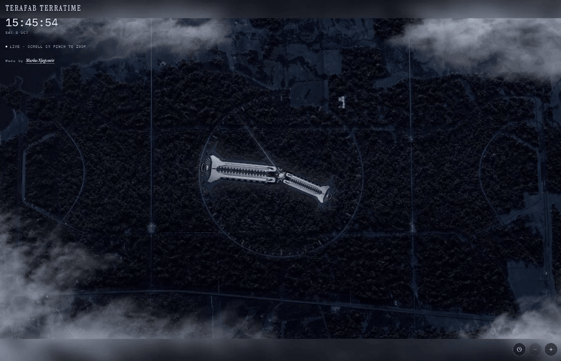

# Terafab Terratime

<p align="center">
  
</p>

A live analog clock set in a night forest. The hour and minute hands are the wings of the site. The second hand is a line of light. They turn over the circular road, from the full landscape down to a clock that fills the screen.

Made by [Marko Njegomir](https://x.com/njmarko).

## Using it

The clock follows your time. Drag around the dial to wind it. When the time has moved, **Now** puts it back.

| | |
| --- | --- |
| Scroll or pinch | Zoom from the whole photograph to the clock filling the view |
| Drag around the center | Wind the hands |
| ← → | Step one minute |
| ↑ ↓ | Step one hour |
| Home | Return to now |
| Clock button | Open the menu |
| Eye | Hide the interface. Click again, or press Escape, to bring it back |

When the photograph is wider than the window, the forest continues above and below as a blurred reflection. If a hand crosses that edge, the blur clears only as far as the hand reaches.

## Clock menu

- **Circle.** Keep the dial on the road, or set its position and size yourself.
- **Lines.** Hour marks, or hour and minute marks. Color and thickness.
- **Numerals.** Arabic or Roman, inside the circle or outside it. Color and thickness.
- **Hands.** Length of each hand. Drag the rows to change which hand sits in front. Or stack them by length, longest behind.
- **Glass.** Blur of the reflection, and whether a hand that leaves the photograph clears it.

**Reset to default** restores the road, the marks, and the hands.

## Run it

Node.js 22 or newer.

```bash
npm install
npm run dev
```

Open [http://localhost:8080](http://localhost:8080).

```bash
npm run build
npm run preview
```

## Stack

[React](https://react.dev) and [TanStack Start](https://tanstack.com/start), [Vite](https://vite.dev), and [Tailwind CSS](https://tailwindcss.com).
